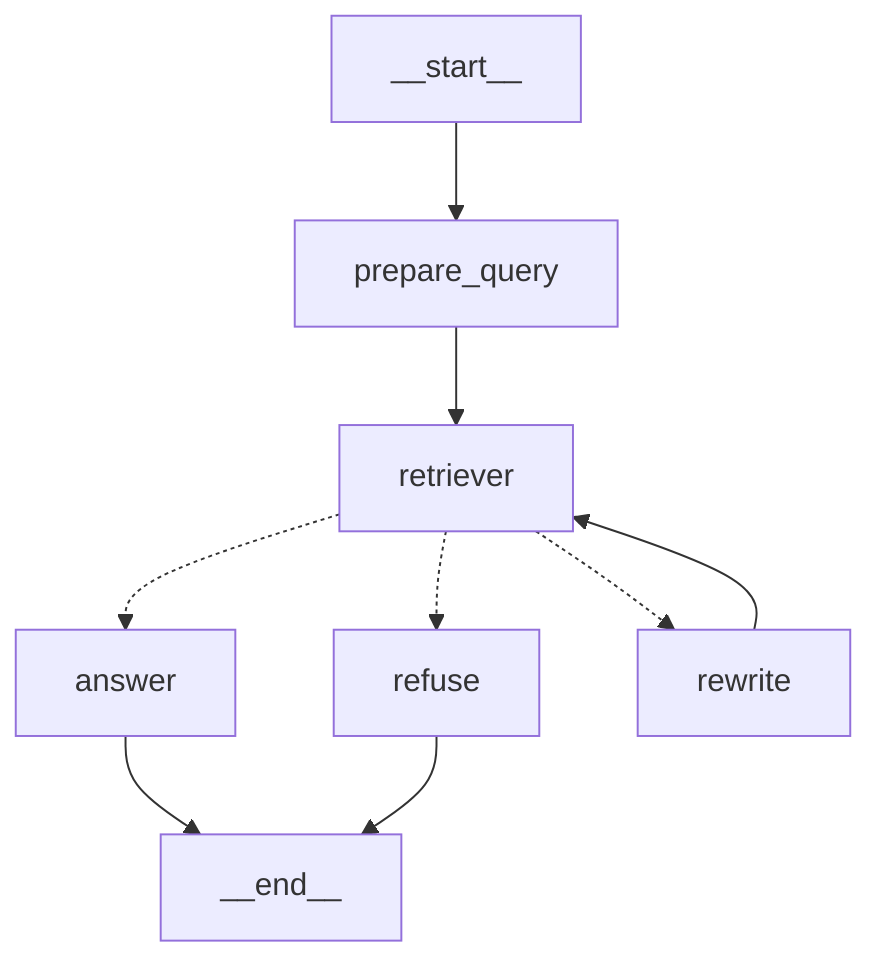

# LangGraph RAG Assistant

CLI RAG assistant using LangGraph and an in-memory vector store.

Documents are loaded from the repo at startup, split into chunks, embedded, and stored in memory.

Retrieval uses the top 4 results with a similarity threshold of 0.40.

If retrieval is weak, the query is rewritten and retried once. If the second attempt is still weak, the assistant refuses to answer.

The assistant answers only from retrieved context and cites the source filename.

The app keeps message history so follow-up questions can use previous conversation context.

Unsupported test question: Is that the same for members?

## Setup
Create and activate a virtual environment:

python3 -m venv .venv
source .venv/bin/activate

Install dependencies:
pip install -e .

## Graph

## Run

python3 -m ticket_assistant.run

## Tests

python3 -m pytest -v

Tests for document loading, graph nodes and edges, routing, and retry limit

## Environment

AWS_PROFILE  
AWS_REGION  
BEDROCK_MODEL_ID  
EMBED_MODEL_ID